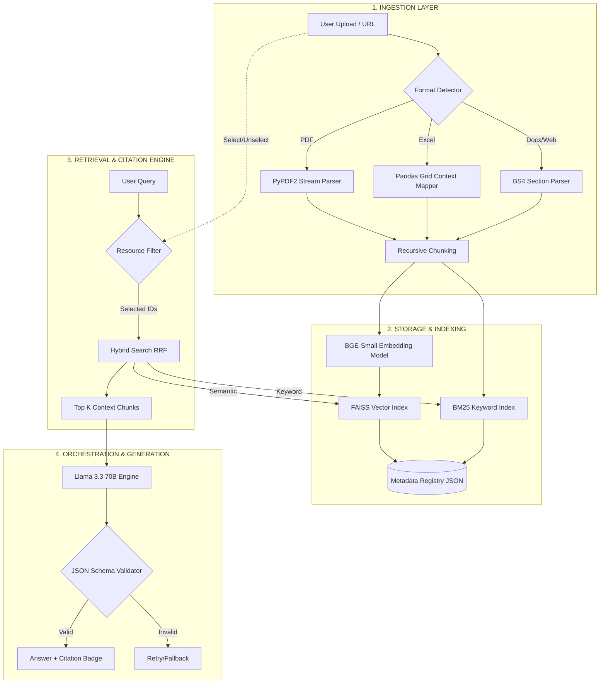

# Architectural Diagram

## Data Flow Narrative:
1.  **Ingestion**: Files are decomposed into chunks while preserving **lineage metadata** (page, row, tab).
2.  **Hybrid Search**: The system runs dual-retrieval (Semantic + Keyword) and merges results via **Reciprocal Rank Fusion (RRF)**.
3.  **Grounded QA**: The LLM (Llama 3.3) is constrained via **System Instructions** to only use the provided chunks.
4.  **Citation Mapping**: The "Citation Engine" pulls the specific metadata from the retrieved chunk and formats it into the UI badge.
